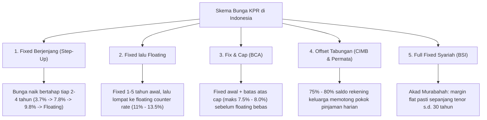
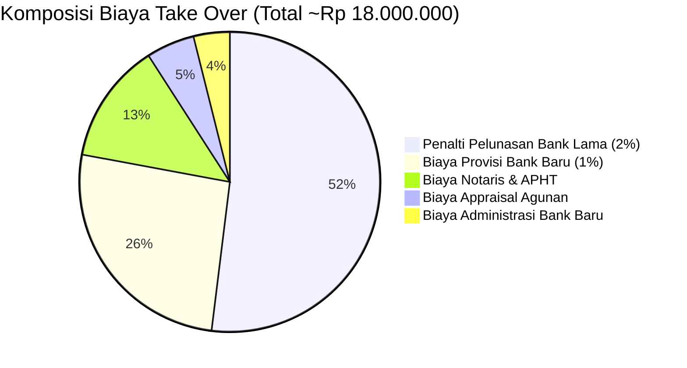
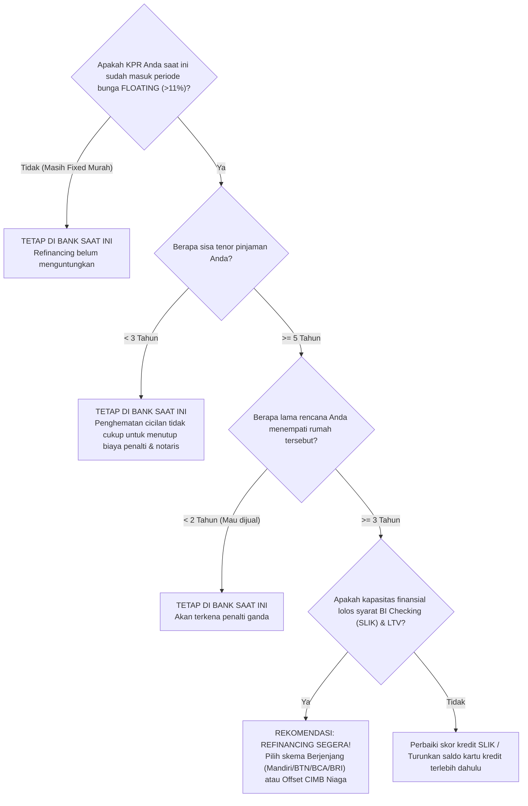

# 📊 Riset Pasar Komprehensif: Skema KPR & Refinancing Bank di Indonesia

> **Tanggal Riset:** September 2026 / Q3 2026  
> **Cakupan Lembaga:** Bank Mandiri, Bank BTN, Bank BRI, CIMB Niaga, Bank BCA, Bank BNI, Bank Danamon, OCBC, Permata Bank, dan BSI (Bank Syariah Indonesia).  
> **Fokus Analisis:** Struktur suku bunga (*fixed*, berjenjang/*step-up*, *floating*, *cap*), durasi tenor masing-masing tahapan bunga, batas minimum & maksimum tenor, *holding period* (ikatan kredit), biaya transaksi (*friction & processing costs*), dan penalti pelunasan dipercepat (*early repayment penalty*).

---

## 📑 Daftar Isi
1. [Ringkasan Eksekutif & Karakteristik Pasar KPR Indonesia](#1-ringkasan-eksekutif--karakteristik-pasar-kpr-indonesia)
2. [Profil Mendalam Perbankan](#2-profil-mendalam-perbankan)
   - [2.1 CIMB Niaga](#21-cimb-niaga)
   - [2.2 Bank BTN](#22-bank-btn)
   - [2.3 Bank Mandiri](#23-bank-mandiri)
   - [2.4 Bank BRI](#24-bank-bri)
   - [2.5 Bank BCA](#25-bank-bca)
   - [2.6 Bank BNI](#26-bank-bni)
   - [2.7 Bank Lainnya (OCBC, Permata, Danamon, BSI Syariah)](#27-bank-lainnya-ocbc-permata-danamon-bsi-syariah)
3. [Matriks Komparasi Parameter KPR Antar-Bank](#3-matriks-komparasi-parameter-kpr-antar-bank)
4. [Simulasi Komparasi Cicilan Riil (Rp 500 Juta & Rp 1 Miliar)](#4-simulasi-komparasi-cicilan-riil-rp-500-juta--rp-1-miliar)
5. [Struktur Biaya Transaksi & Penalti Refinancing (*Friction Costs*)](#5-struktur-biaya-transaksi--penalti-refinancing-friction-costs)
6. [Glosarium Parameter & Istilah Teknis Perbankan](#6-glosarium-parameter--istilah-teknis-perbankan)
7. [Panduan Keputusan Refinancing untuk Debitur](#7-panduan-keputusan-refinancing-untuk-debitur)

---

## 1. Ringkasan Eksekutif & Karakteristik Pasar KPR Indonesia

Pasar Kredit Pemilikan Rumah (KPR) dan pembiayaan properti di Indonesia memiliki dinamika unik yang sangat dipengaruhi oleh suku bunga acuan Bank Indonesia (BI-Rate) dan strategi likuiditas masing-masing bank.

Secara umum, terdapat 5 tipologi skema suku bunga yang ditawarkan perbankan nasional:

### Fenomena Utama Pasar:
1. **"Floating Shock" pada Tahun ke-4 ke Atas:**  
   Debitur yang mengambil skema fixed rate 3 tahun umumnya mengalami kenaikan cicilan sebesar **40% – 60%** saat memasuki tahun ke-4 ketika bunga beralih ke suku bunga floating (*counter rate*) yang berada di level **11.00% – 13.50%**. Kondisi ini menjadi pendorong utama pasar *Refinancing / Take Over*.
2. **Ketatnya Holding Period Promo Berjenjang:**  
   Untuk mendapatkan bunga promo berjenjang yang sangat rendah di tahun awal (3%–4%), bank mewajibkan debitur menandatangani perjanjian kredit dengan tenor minimal **10 hingga 15 tahun**. Pelunasan dipercepat sebelum tenor minimum akan dikenakan penalti **2% hingga 5%** dari sisa pokok pinjaman.
3. **Maturity Gap Antara Bank BUMN vs Swasta:**  
   Bank BUMN (BTN, BNI, Mandiri, BRI) menawarkan tenor hingga **30 tahun** untuk segmen generasi muda/karyawan, sedangkan bank swasta tier-1 (BCA) membatasi tenor maksimal di angka **20 tahun** guna mitigasi risiko kredit jangka panjang.

---

## 2. Profil Mendalam Perbankan

---

### 2.1 CIMB Niaga
*PT Bank CIMB Niaga Tbk*

CIMB Niaga merupakan pionir produk KPR paling fleksibel di Indonesia dengan fitur *smart mortgage* yang menghubungkan portofolio tabungan dengan pinjaman KPR.

#### A. Skema KPR Xtra Berjenjang (*Graduated Rate*)
* **Sasaran:** Pembelian properti baru/bekas, *take over*, dan *refinancing*.
* **Tahapan Suku Bunga:**
  * **Tahap 1 (Tahun ke-1):** `3.90% – 4.15% p.a. fixed` (promo developer rekanan bisa mulai `2.99%`)
  * **Tahap 2 (Tahun ke-2 s.d. 3):** `6.25% – 6.99% p.a. fixed`
  * **Tahap 3 (Tahun ke-4 s.d. 6):** `8.25% – 8.99% p.a. fixed`
  * **Tahap 4 (Tahun ke-7 s.d. 10):** `9.99% – 10.50% p.a. fixed`
  * **Tahap Akhir (Tahun ke-11 s.d. Lunas):** `Floating` (SBDK CIMB Niaga ~7.30% + spread nasabah = **~10.75% – 12.00%**)
* **Ketentuan Tenor:**
  * **Minimum Tenor Pinjaman:** **12 – 15 Tahun** (bergantung tier promo)
  * **Maksimum Tenor Pinjaman:** **25 Tahun** (Karyawan), **20 Tahun** (Wiraswasta / Profesional)
* **Ketentuan Penalti Pelunasan Dipercepat:**
  * Selama periode promo berjenjang (Tahun 1–10): **3.00% – 5.00%** dari sisa pokok pinjaman yang dilunasi.
  * Setelah periode berjenjang (periode floating): **0% (Bebas Penalti)** atau maks 1.00%.
* **Struktur Biaya:**
  * **Provisi:** 1.00% dari plafon (sering diskon 50% atau gratis promo tertentu).
  * **Administrasi:** Rp 500.000 – Rp 1.500.000.
  * **Appraisal:** Rp 750.000 – Rp 1.500.000 (Gratis bila appraisal internal online).
  * **Asuransi:** Jiwa Kredit & Kebakaran (sesuai tarif rekanan Sompo / Sun Life).

#### B. Skema KPR Xtra Bebas Bunga & Xtra Manfaat (*Offset Mortgage*)
* **Karakteristik Unik:**
  * Debitur dapat menghubungkan hingga **9 rekening tabungan keluarga** (orang tua, pasangan, anak, saudara).
  * **80% dari total saldo tabungan** harian diperhitungkan untuk memotong saldo pokok pinjaman dalam formula perhitungan bunga.
  * **Dampak Finansial:** Bunga bulanan dapat ditekan hingga **Rp 0** (bebas bunga), dan cicilan bulanan yang dibayarkan 100% langsung memotong sisa pokok, sehingga tenor pinjaman dapat terpangkas drastis tanpa terkena denda penalti pelunasan.

---

### 2.2 Bank BTN
*PT Bank Tabungan Negara (Persero) Tbk*

Bank BTN memegang pangsa pasar KPR terbesar di Indonesia (>38% total industri) dengan fokus kuat pada perumahan rakyat, program milenial, dan ekosistem properti komprehensif.

#### A. Skema KPR BTN Platinum & Berjenjang (*Step-Up Harapan*)
* **Sasaran:** Pembelian rumah baru (*primary*), rumah seken (*secondary*), dan fasilitas *Take Over*.
* **Tahapan Suku Bunga:**
  * **Tahap 1 (Tahun 1 – 3):** `3.99% – 4.75% p.a. fixed` (pada event expo/HUT dapat mencapai `2.65% – 3.75%`)
  * **Tahap 2 (Tahun 4 – 6):** `7.49% – 8.25% p.a. fixed`
  * **Tahap 3 (Tahun 7 – 10):** `9.49% – 10.25% p.a. fixed`
  * **Tahap Akhir (Tahun 11+ s.d. Lunas):** `Floating` (SBDK BTN ~7.35% + premi risiko = **~11.50% – 13.50%**)
* **Ketentuan Tenor:**
  * **Minimum Tenor Pinjaman:** **15 Tahun** untuk skema berjenjang 10 tahun.
  * **Maksimum Tenor Pinjaman:**
    * **KPR BTN Gaesss (Milenial usia 21–35 tahun):** Hingga **30 Tahun** (usia maks saat lunas: 65 tahun).
    * **Karyawan Reguler:** Hingga **25 – 30 Tahun**.
    * **Wiraswasta / Pengusaha:** Hingga **20 – 25 Tahun**.
* **Ketentuan Penalti Pelunasan Dipercepat:**
  * Selama masa ikatan fixed/berjenjang: **3.00% – 5.00%** dari total pokok yang dilunasi.
  * Setelah masa fixed berakhir (periode floating): **1.00%**.
* **Struktur Biaya:**
  * **Provisi:** 1.00% dari plafon kredit disetujui (sering ada diskon 50% atau bebas provisi).
  * **Administrasi:** Rp 500.000 – Rp 750.000.
  * **Appraisal:** Rp 750.000 – Rp 1.500.000.
* **Fitur Tambahan:**
  * **Grace Period Pokok:** Program KPR BTN Gaesss memungkinkan debitur hanya membayar porsi bunga pinjaman saja selama 1 hingga 2 tahun pertama, sebelum cicilan pokok mulai ditagihkan.
  * **Take Over + Top Up:** Kemudahan mencairkan dana segar untuk biaya renovasi atau kebutuhan konsumtif dengan jaminan agunan yang sama.

---

### 2.3 Bank Mandiri
*PT Bank Mandiri (Persero) Tbk*

Bank Mandiri unggul dalam segmen debitur *payroll*, karyawan BUMN, ASN, dan korporasi multinasional rekanan dengan integrasi penuh ke aplikasi digital Livin' by Mandiri.

#### A. Skema Mandiri KPR Angsuran Berjenjang (*Graduated Rate*)
* **Sasaran:** Pembelian properti baru/seken dan Mandiri KPR Take Over.
* **Tahapan Suku Bunga:**
  * **Tahap 1 (Tahun 1 – 3):** `3.88% – 4.88% p.a. fixed`
  * **Tahap 2 (Tahun 4 – 6):** `7.88% – 8.50% p.a. fixed`
  * **Tahap 3 (Tahun 7 – 10):** `9.88% – 10.50% p.a. fixed`
  * **Tahap Akhir (Tahun 11+ s.d. Lunas):** `Floating` (SBDK Mandiri ~7.30% + spread bank = **~11.50% – 12.50%**)
* **Ketentuan Tenor:**
  * **Minimum Tenor Pinjaman:** **12 Tahun** (wajib untuk menikmati paket berjenjang 10 tahun).
  * **Maksimum Tenor Pinjaman:**
    * **Karyawan Fixed Income:** Hingga **25 Tahun** (usia pensiun maks 55–60 tahun).
    * **Wiraswasta / Profesional:** Hingga **20 Tahun** (usia maks 65 tahun).
* **Ketentuan Penalti Pelunasan Dipercepat:**
  * Masa ikatan kredit (Holding Period Thn 1–10): **3.00% – 5.00%** dari baki debet yang dilunasi.
  * Periode floating (setelah Thn 10): **1.00% – 2.00%**.
* **Struktur Biaya:**
  * **Provisi:** 1.00% dari plafon kredit (sering bebas provisi untuk nasabah payroll Mandiri / PNS / BUMN).
  * **Administrasi:** Rp 500.000 – Rp 1.500.000 (atau 0.1% plafon).
  * **Appraisal:** Rp 1.000.000 – Rp 1.500.000 (KJPP rekanan) / Gratis untuk developer rekanan tier-1.
* **Fitur Take Over:** **Mandiri KPR Take Over + Top Up** dengan plafon tambahan hingga LTV maksimal 85%–90%.

#### B. Skema Mandiri KPR Fixed Reguler
* **Pilihan Suku Bunga:**
  * **Fixed 1 Tahun:** `3.65% – 3.88%` (Min. tenor: 3–5 tahun)
  * **Fixed 3 Tahun:** `5.65% – 6.25%` (Min. tenor: 8–10 tahun)
  * **Fixed 5 Tahun:** `6.88% – 7.50%` (Min. tenor: 10–12 tahun)
  * **Fixed 10 Tahun:** `8.50% – 9.25%` (Min. tenor: 15 tahun)
  * **Floating setelahnya:** `11.50% – 12.50%`

---

### 2.4 Bank BRI
*PT Bank Rakyat Indonesia (Persero) Tbk*

Bank dengan basis nasabah terbesar dan jaringan kantor terluas di Indonesia, menawarkan kemudahan akses KPR hingga ke kota tier-2 dan tier-3.

#### A. Skema BRI KPR Bunga Berjenjang Promo
* **Sasaran:** Pembelian rumah baru/seken dan KPR BRI Take Over.
* **Tahapan Suku Bunga (Paket 10 Tahun):**
  * **Tahap 1 (Tahun 1):** `3.77% p.a. fixed`
  * **Tahap 2 (Tahun 2 – 3):** `5.77% p.a. fixed`
  * **Tahap 3 (Tahun 4 – 6):** `7.87% p.a. fixed`
  * **Tahap 4 (Tahun 7 – 10):** `9.87% p.a. fixed`
  * **Tahap Akhir (Tahun 11+ s.d. Lunas):** `Floating` (SBDK BRI ~7.25% + margin = **~11.00% – 12.75%**)
* **Ketentuan Tenor:**
  * **Minimum Tenor Pinjaman:** **10 Tahun** (paket 10-15 tahun) atau **15 Tahun** (paket 20 tahun).
  * **Maksimum Tenor Pinjaman:**
    * **Karyawan Fixed Income:** Hingga **25 Tahun** (usia maks 60 tahun saat lunas).
    * **Wiraswasta / Non-Fixed Income:** Hingga **20 Tahun** (usia maks 65 tahun).
* **Ketentuan Penalti Pelunasan Dipercepat:**
  * Selama periode promo berjenjang (Tahun 1–10): **2.50% – 3.00%** dari sisa pokok pinjaman.
  * Setelah periode promo berjenjang berakhir: **1.00%**.
* **Struktur Biaya:**
  * **Provisi:** 1.00% dari plafon (nasabah payroll BritAma mendapatkan diskon 50%).
  * **Administrasi:** 0.10% dari plafon (minimal Rp 500.000, maksimal Rp 1.500.000).
  * **Appraisal:** Rp 500.000 – Rp 1.250.000 (Bebas biaya jika penilaian agunan internal BRI untuk plafon < Rp 1 Miliar).

---

### 2.5 Bank BCA
*PT Bank Central Asia Tbk*

Bank swasta terbesar di Indonesia yang dikenal memiliki reputasi suku bunga floating paling stabil, transparan, dan terendah di industri perbankan nasional.

#### A. Skema KPR BCA Fix & Cap
* **Konsep:** Memberikan garansi kepastian suku bunga di awal, disusul batas plafon atas (*cap*) pada tahap berikutnya sehingga nasabah terlindungi dari lonjakan bunga pasar.
* **Tahapan Suku Bunga:**
  * **Tahap 1 - Fixed (Tahun 1 – 2 atau 1 – 3):** `5.00% – 6.00% p.a. fixed`
  * **Tahap 2 - Cap (Tahun ke-3/4 s.d. Tahun ke-5):** `Cap (Maksimal) 7.50% – 8.00% p.a.` (bunga floating tidak akan pernah melebihi angka batas cap ini)
  * **Tahap Akhir (Tahun 6+ s.d. Lunas):** `Floating` murni (SBDK BCA ~7.20% + spread = **~10.00% – 11.25%**)
* **Ketentuan Tenor:**
  * **Minimum Tenor Pinjaman:** **8 – 10 Tahun**.
  * **Maksimum Tenor Pinjaman:** **20 Tahun** (Karyawan), **15 – 20 Tahun** (Wiraswasta).
* **Ketentuan Penalti Pelunasan Dipercepat:**
  * Selama 5 tahun periode Fix & Cap: **2.00%** dari pokok pinjaman yang dilunasi.
  * **Setelah Tahun ke-5 (Periode Floating):** **Bebas Penalti (0.00%)**!
* **Struktur Biaya:**
  * **Provisi:** 1.00% plafon (sering gratis pada event BCA Expo / BCA Expoversary).
  * **Administrasi:** Rp 500.000 – Rp 1.000.000.
  * **Appraisal:** Rp 1.100.000 – Rp 1.500.000 per agunan.

#### B. Skema KPR BCA Fixed Berjenjang
* **Paket Tenor 10 Tahun:** Th 1–3: `4.25%`, Th 4–6: `7.50%`, Th 7–10: `9.50%`. (Min tenor: 10 tahun).
* **Paket Tenor 20 Tahun:** Th 1–3: `3.75%`, Th 4–6: `7.25%`, Th 7–10: `9.25%`, Th 11–20: `Floating ~10.50%`. (Min tenor: 20 tahun).

#### C. Skema BCA Fixed Pendek Bebas Penalti (Fitur Unggulan Industri)
* **Fix 1 Tahun:** `~3.25% – 3.75%` (Min tenor 3 tahun). **Bebas penalti 0%** jika dilunasi setelah tahun ke-1!
* **Fix 2 Tahun:** `~3.75% – 4.25%` (Min tenor 3 tahun). **Bebas penalti 0%** jika dilunasi setelah tahun ke-2!

---

### 2.6 Bank BNI
*PT Bank Negara Indonesia (Persero) Tbk*

BNI memiliki fokus strategis melayani generasi muda milenial dan Gen-Z melalui fasilitas KPR berjangka panjang hingga 30 tahun.

#### A. Skema BNI Griya Berjenjang (*BNI Griya Gue*)
* **Sasaran:** Pembelian properti baru/seken dan BNI Griya Take Over Plus.
* **Tahapan Suku Bunga:**
  * **Tahap 1 (Tahun 1 – 2):** `3.75% – 4.25% p.a. fixed`
  * **Tahap 2 (Tahun 3 – 5):** `6.75% – 7.50% p.a. fixed`
  * **Tahap 3 (Tahun 6 – 10):** `8.75% – 9.75% p.a. fixed`
  * **Tahap Akhir (Tahun 11+ s.d. Lunas):** `Floating` (SBDK BNI ~7.25% + margin = **~11.25% – 12.50%**)
* **Ketentuan Tenor:**
  * **Minimum Tenor Pinjaman:** **15 Tahun** untuk skema berjenjang 10 tahun.
  * **Maksimum Tenor Pinjaman:**
    * **BNI Griya Gue (Milenial usia 21–35 tahun):** Hingga **30 Tahun** (usia pensiun maks 55–65 tahun).
    * **Karyawan Reguler:** Hingga **25 Tahun**.
    * **Wiraswasta:** Hingga **20 Tahun**.
* **Ketentuan Penalti Pelunasan Dipercepat:**
  * Masa ikatan kredit (Holding Period Thn 1–10): **2.00% – 3.00%** dari sisa baki debet.
  * Periode floating (setelah Thn 10): **1.00%**.
* **Struktur Biaya:**
  * **Provisi:** 0.50% – 1.00% dari plafon kredit.
  * **Administrasi:** Rp 500.000 – Rp 1.000.000.
  * **Appraisal:** Rp 750.000 – Rp 1.250.000.
* **Fitur Take Over:** **BNI Griya Take Over Plus** (menutup KPR bank lama + penambahan limit tunai untuk kebutuhan konsumtif/investasi).

---

### 2.7 Bank Lainnya (OCBC, Permata, Danamon, BSI Syariah)

| Parameter | OCBC (KPR Easy Start) | Permata Bank (PermataKPR Bijak) | Bank Danamon (KPR Super Deal) | Bank Syariah Indonesia (BSI Griya) |
| :--- | :--- | :--- | :--- | :--- |
| **Model Bunga** | Cicilan berjenjang naik teratur tiap 2–3 thn | Offset tabungan + Fixed promo | Fixed bertahap & Step-up | **Akad Murabahah (Full Fixed)** |
| **Suku Bunga** | • Th 1–2: `3.85% - 4.50%` • Th 3–5: `6.75% - 7.50%` • Floating: `11.00% - 12.25%` | • Fix 3 Thn: `4.25%` • Floating: `11.50% - 12.50%` • **75% saldo tabungan memotong pokok** | • Fix 3 Thn: `3.75% - 4.50%` • Jenjang Th 1-3 `4.5%`, Th 4-6 `7.5%`, Th 7-10 `9.5%` • Floating: `11.50% - 12.50%` | • Setara **`7.50% – 8.75% FLAT/FIXED`** sampai akhir tenor lunas! • **Tanpa suku bunga floating** |
| **Min. Tenor** | **10 Tahun** | **5 Tahun** | **10 Tahun** | **5 Tahun** |
| **Maks. Tenor** | **25 Tahun** | **30 Tahun** | **20 Tahun** | **30 Tahun** (Simuda) |
| **Biaya Provisi** | 1.00% plafon | 1.00% plafon | 1.00% plafon | **0.00% (Bebas Biaya Provisi)** |
| **Biaya Admin** | Rp 750.000 | Rp 500.000 – Rp 1.000.000 | Rp 500.000 – Rp 1.000.000 | Rp 500.000 – Rp 1.000.000 |
| **Penalti Pelunasan** | 2% – 3% selama masa promo | 2% – 3% selama masa fixed; 1% floating | 3% masa lock-in; 1% setelahnya | **0.00% (Bebas Denda Penalti)** |
| **Keunggulan Unik**| Menyesuaikan kenaikan gaji debitur muda | Bunga bisa 0% jika tabungan setara pokok pinjaman | Approval cepat & promo bundling | Kepastian mutlak nominal angsuran, bebas riba |

---

## 3. Matriks Komparasi Parameter KPR Antar-Bank

Tabel perbandingan berdampingan (*side-by-side*) seluruh bank:

| Parameter Kunci | Bank Mandiri | Bank BTN | Bank BRI | CIMB Niaga | Bank BCA | Bank BNI | Bank BSI (Syariah) |
| :--- | :--- | :--- | :--- | :--- | :--- | :--- | :--- |
| **Bunga Jenjang Th 1-3** | 3.88% – 4.88% | 3.99% – 4.75% | 3.77% – 5.77% | 3.90% – 6.99% | 3.75% – 4.25% | 3.75% – 4.25% | *N/A (Full Fixed 7.75% s.d akhir)* |
| **Bunga Jenjang Th 4-6** | 7.88% – 8.50% | 7.49% – 8.25% | 7.87% | 8.25% – 8.99% | 7.25% – 7.50% | 6.75% – 7.50% | *Tetap 7.75%* |
| **Bunga Jenjang Th 7-10** | 9.88% – 10.50% | 9.49% – 10.25% | 9.87% | 9.99% – 10.50% | 9.25% – 9.50% | 8.75% – 9.75% | *Tetap 7.75%* |
| **Estimasi Bunga Floating** | 11.50% – 12.50% | 11.50% – 13.50% | 11.00% – 12.75% | 10.75% – 12.00% | **10.00% – 11.25%** | 11.25% – 12.50% | **0.00% (Tidak ada floating)** |
| **Min. Tenor Berjenjang** | 12 Tahun | 15 Tahun | 10 – 15 Tahun | 12 – 15 Tahun | 8 – 10 Tahun | 15 Tahun | 5 Tahun |
| **Maks. Tenor Karyawan** | 25 Tahun | **30 Tahun** | 25 Tahun | 25 Tahun | 20 Tahun | **30 Tahun** | **30 Tahun** |
| **Maks. Tenor Wiraswasta**| 20 Tahun | 25 Tahun | 20 Tahun | 20 Tahun | 15 – 20 Tahun | 20 Tahun | 20 Tahun |
| **Biaya Provisi Standar** | 1.00% | 1.00% | 1.00% | 1.00% | 1.00% | 0.50% – 1.00% | **0.00% (Bebas Provisi)** |
| **Biaya Administrasi** | Rp 500rb – 1.5jt | Rp 500rb – 750rb | Rp 500rb – 1.5jt | Rp 500rb – 1.5jt | Rp 500rb – 1jt | Rp 500rb – 1jt | Rp 500rb – 1jt |
| **Penalti Masa Lock-in** | 3.00% – 5.00% | 3.00% – 5.00% | 2.50% – 3.00% | 3.00% – 5.00% | **2.00%** | 2.00% – 3.00% | **0.00% (Bebas Denda)** |
| **Penalti Masa Floating**| 1.00% – 2.00% | 1.00% | 1.00% | **0.00% – 1.00%** | **0.00% (Bebas)** | 1.00% | **0.00%** |
| **Keunggulan Utama** | Payroll BUMN & Livin' | Kuota KPR terbesar, 30 th | Jaringan terluas | Offset rekening keluarga | Floating paling stabil & rendah | Generasi muda Griya Gue | Kepastian margin, bebas riba |

---

## 4. Simulasi Komparasi Cicilan Riil (Rp 500 Juta & Rp 1 Miliar)

Sebagai ilustrasi komparasi konkret, berikut adalah simulasi cicilan bulanan menggunakan formula anuitas standar perbankan:

### Skenario A: Plafon Pinjaman Rp 500.000.000 (Tenor 15 Tahun / 180 Bulan)
*Perbandingan antara meneruskan KPR Lama (Floating 12.00%) vs Pindah ke Skema Berjenjang Bank Baru:*

| Periode Waktu | Skenario Bank Lama (Floating 12%) | Bank Baru (Mandiri / BTN / BCA Berjenjang) | Selisih Penghematan / Bulan | Akumulasi Penghematan Periode |
| :--- | :--- | :--- | :--- | :--- |
| **Tahun 1 – 3** | Rp 6.000.840 / bln (`12.00%`) | **Rp 3.824.160 / bln** (`4.50% fixed`) | **+ Rp 2.176.680 / bln** | **Rp 78.360.480** (36 bulan) |
| **Tahun 4 – 6** | Rp 6.000.840 / bln (`12.00%`) | **Rp 4.708.230 / bln** (`7.75% fixed`) | **+ Rp 1.292.610 / bln** | **Rp 46.533.960** (36 bulan) |
| **Tahun 7 – 10** | Rp 6.000.840 / bln (`12.00%`) | **Rp 5.289.440 / bln** (`9.75% fixed`) | **+ Rp 711.400 / bln** | **Rp 34.147.200** (48 bulan) |
| **Tahun 11 – 15**| Rp 6.000.840 / bln (`12.00%`) | Rp 5.720.000 / bln (`11.00% floating`) | + Rp 280.840 / bln | Rp 16.850.400 (60 bulan) |
| **Total Pembayaran** | **Rp 1.080.151.200** | **Rp 904.259.160** | — | **Total Hemat: Rp 175.892.040** |

---

### Skenario B: Plafon Pinjaman Rp 1.000.000.000 (Tenor 20 Tahun / 240 Bulan)
*Perbandingan antara meneruskan KPR Lama (Floating 12.50%) vs Pindah ke Skema Berjenjang Bank Baru:*

| Periode Waktu | Bank Lama (Floating 12.5%) | Bank Baru (Berjenjang: 3.9% -> 7.5% -> 9.5% -> Floating 11%) | Selisih Penghematan / Bulan |
| :--- | :--- | :--- | :--- |
| **Tahun 1 – 3** | Rp 11.361.400 / bln | **Rp 6.471.200 / bln** (`3.90% fixed`) | **+ Rp 4.890.200 / bln** |
| **Tahun 4 – 6** | Rp 11.361.400 / bln | **Rp 8.528.900 / bln** (`7.50% fixed`) | **+ Rp 2.832.500 / bln** |
| **Tahun 7 – 10** | Rp 11.361.400 / bln | **Rp 9.814.700 / bln** (`9.50% fixed`) | **+ Rp 1.546.700 / bln** |
| **Tahun 11 – 20**| Rp 11.361.400 / bln | Rp 10.650.000 / bln (`11.00% floating`) | + Rp 711.400 / bln |
| **Total Hemat Kas** | — | — | **Total Penghematan Kas: > Rp 370.000.000** |

---

## 5. Struktur Biaya Transaksi & Penalti Refinancing (*Friction Costs*)

Melakukan proses refinancing / take-over membutuhkan modal awal (*friction cost*). Estimasi biaya tipikal untuk pinjaman sebesar Rp 500.000.000:

1. **Biaya Upfront Tunai (Bank Lama):**
   - **Penalti Pelunasan Dipercepat:** Rata-rata 1.0% hingga 3.0% dari sisa baki debet pinjaman (misal Rp 500 Juta × 2% = Rp 10.000.000).
2. **Biaya Proses Bank Baru (*Dapat Dikapitalisasi ke Plafon Baru*):**
   - **Biaya Provisi:** 1.0% dari plafon kredit baru (= Rp 5.000.000).
   - **Biaya Administrasi:** Rp 500.000 – Rp 1.500.000.
   - **Biaya Penilaian Agunan (Appraisal):** Rp 750.000 – Rp 1.500.000.
   - **Biaya Notaris / APHT (Akta Pemberian Hak Tanggungan):** Rp 2.000.000 – Rp 4.000.000 (termasuk roya hak tanggungan di bank lama, pasang hak tanggungan baru, dan cek sertifikat di BPN).
   - **Premi Asuransi Jiwa & Kebakaran:** Bergantung pada usia debitur dan nilai taksiran bangunan (sekitar 0.5% – 1.5% dari nilai pertanggungan).
3. **Kalkulasi Break-Even Point (BEP):**
   $$\text{BEP (Bulan)} = \frac{\text{Total Biaya Penalti \& Proses Transaksi}}{\text{Penghematan Cicilan Bulanan}}$$
   *Dengan total biaya Rp 18.000.000 dan penghematan cicilan Rp 2.176.000/bulan di tahun 1-3, **BEP tercapai hanya dalam 8.3 bulan!***

---

## 6. Glosarium Parameter & Istilah Teknis Perbankan

* **SBDK (Suku Bunga Dasar Kredit):** Suku bunga dasar terendah yang diumumkan perbankan ke publik sesuai regulasi OJK / Bank Indonesia, belum memperhitungkan premi risiko nasabah individual (*credit risk spread*).
* **Floating Rate (Suku Bunga Mengambang):** Suku bunga yang bergerak naik atau turun mengikuti kondisi pasar uang, BI-Rate, dan kebijakan suku bunga internal bank.
* **Graduated Payment / Step-Up Rate:** Struktur bunga bertingkat yang telah disepakati di awal perjanjian kredit (misal 3 tahun awal rendah, 3 tahun kedua menengah, 4 tahun ketiga tinggi).
* **Cap Rate (Batas Atas):** Tingkat bunga maksimum yang dijaminkan bank tidak akan dilewati meskipun suku bunga pasar melonjak drastis.
* **Holding Period / Lock-in Period:** Durasi waktu minimum yang disyaratkan bank di mana debitur dilarang melunasi pinjaman atau memindahkan KPR ke bank lain tanpa terkena denda penalti.
* **Early Repayment Penalty:** Biaya denda penalti yang wajib disetor debitur jika melakukan pelunasan pokok kredit lebih cepat dari jadwal amortisasi normal.
* **Capitalized Fees (Biaya Dikapitalisasi):** Biaya proses kredit (provisi, admin, appraisal, notaris, asuransi) yang tidak dibayar tunai di muka melainkan ditambahkan langsung ke dalam pokok pinjaman baru.
* **LTV (Loan-to-Value Ratio):** Rasio antara nilai kredit pinjaman terhadap nilai pasar agunan properti yang dinilai oleh tim appraisal (*maksimal regulasi BI: 80% – 100%*).
* **DSR (Debt Service Ratio):** Rasio total cicilan utang bulanan nasabah dibandingkan total pendapatan bersih bulanan (*standar perbankan: 35% – 45%*).

---

## 7. Panduan Keputusan Refinancing untuk Debitur

Kapan seorang debitur sebaiknya melakukan refinancing (*take over*) KPR?

